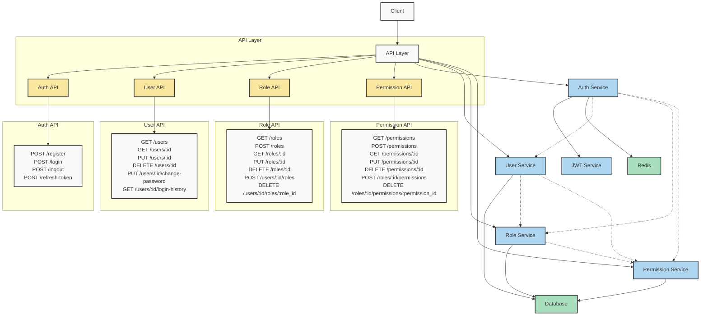
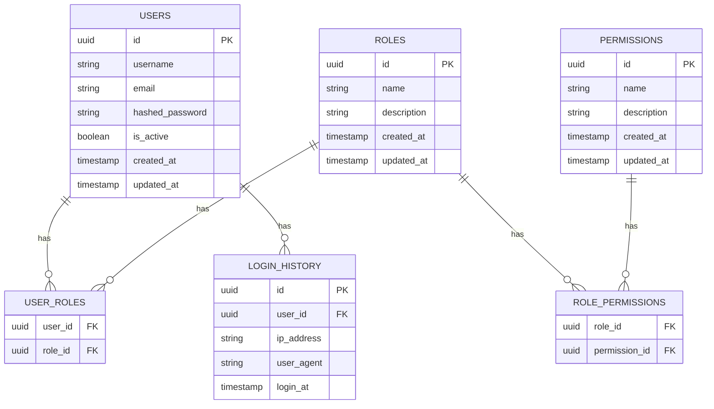

# Архитектура системы

Эта диаграмма представляет общую архитектуру нашей системы, включая API endpoints, сервисы и базы данных.

## Схема базы данных

## API Documentation

### POST /register
- Входные данные: `{ "username": string, "email": string, "password": string }`
- Возвращаемые данные: `{ "access_token": string, "refresh_token": string, "token_type": string }`
- Описание: Регистрация нового пользователя в системе

### POST /login
- Входные данные: `{ "username": string, "password": string }`
- Возвращаемые данные: `{ "access_token": string, "refresh_token": string, "token_type": string }`
- Описание: Аутентификация пользователя и выдача токенов

### POST /logout
- Входные данные: `{ "refresh_token": string }`
- Возвращаемые данные: `{ "message": string }`
- Описание: Выход пользователя из системы и инвалидация токенов

### POST /refresh-token
- Входные данные: `{ "refresh_token": string }`
- Возвращаемые данные: `{ "access_token": string, "refresh_token": string, "token_type": string }`
- Описание: Обновление access-токена с использованием refresh-токена

## User API

### GET /users
- Входные данные: Query parameters `page: int, size: int`
- Возвращаемые данные: `{ "items": [User], "total": int, "page": int, "size": int }`
- Описание: Получение списка пользователей с пагинацией

### GET /users/{id}
- Входные данные: Path parameter `id: UUID`
- Возвращаемые данные: `User`
- Описание: Получение информации о конкретном пользователе

### PUT /users/{id}
- Входные данные: Path parameter `id: UUID`, Body `{ "username": string, "email": string }`
- Возвращаемые данные: `User`
- Описание: Обновление информации пользователя

### DELETE /users/{id}
- Входные данные: Path parameter `id: UUID`
- Возвращаемые данные: `{ "message": string }`
- Описание: Удаление пользователя из системы

### PUT /users/{id}/change-password
- Входные данные: Path parameter `id: UUID`, Body `{ "current_password": string, "new_password": string }`
- Возвращаемые данные: `{ "message": string }`
- Описание: Изменение пароля пользователя

### GET /users/{id}/login-history
- Входные данные: Path parameter `id: UUID`, Query parameters `page: int, size: int`
- Возвращаемые данные: `{ "items": [LoginHistory], "total": int, "page": int, "size": int }`
- Описание: Получение истории входов пользователя с пагинацией

## Role API

### GET /roles
- Входные данные: Query parameters `page: int, size: int`
- Возвращаемые данные: `{ "items": [Role], "total": int, "page": int, "size": int }`
- Описание: Получение списка ролей с пагинацией

### POST /roles
- Входные данные: `{ "name": string, "description": string }`
- Возвращаемые данные: `Role`
- Описание: Создание новой роли

### GET /roles/{id}
- Входные данные: Path parameter `id: UUID`
- Возвращаемые данные: `Role`
- Описание: Получение информации о конкретной роли

### PUT /roles/{id}
- Входные данные: Path parameter `id: UUID`, Body `{ "name": string, "description": string }`
- Возвращаемые данные: `Role`
- Описание: Обновление информации о роли

### DELETE /roles/{id}
- Входные данные: Path parameter `id: UUID`
- Возвращаемые данные: `{ "message": string }`
- Описание: Удаление роли из системы

### POST /users/{id}/roles
- Входные данные: Path parameter `id: UUID`, Body `{ "role_id": UUID }`
- Возвращаемые данные: `User`
- Описание: Назначение роли пользователю

### DELETE /users/{id}/roles/{role_id}
- Входные данные: Path parameters `id: UUID, role_id: UUID`
- Возвращаемые данные: `User`
- Описание: Отзыв роли у пользователя

## Permission API

### GET /permissions
- Входные данные: Query parameters `page: int, size: int`
- Возвращаемые данные: `{ "items": [Permission], "total": int, "page": int, "size": int }`
- Описание: Получение списка разрешений с пагинацией

### POST /permissions
- Входные данные: `{ "name": string, "description": string }`
- Возвращаемые данные: `Permission`
- Описание: Создание нового разрешения

### GET /permissions/{id}
- Входные данные: Path parameter `id: UUID`
- Возвращаемые данные: `Permission`
- Описание: Получение информации о конкретном разрешении

### PUT /permissions/{id}
- Входные данные: Path parameter `id: UUID`, Body `{ "name": string, "description": string }`
- Возвращаемые данные: `Permission`
- Описание: Обновление информации о разрешении

### DELETE /permissions/{id}
- Входные данные: Path parameter `id: UUID`
- Возвращаемые данные: `{ "message": string }`
- Описание: Удаление разрешения из системы

### POST /roles/{id}/permissions
- Входные данные: Path parameter `id: UUID`, Body `{ "permission_id": UUID }`
- Возвращаемые данные: `Role`
- Описание: Назначение разрешения роли

### DELETE /roles/{id}/permissions/{permission_id}
- Входные данные: Path parameters `id: UUID, permission_id: UUID`
- Возвращаемые данные: `Role`
- Описание: Отзыв разрешения у роли

### Пояснения к диаграмме архитектуры

- **API Layer**: Содержит все эндпоинты, сгруппированные по функциональности.
- **Сервисы**: Реализуют бизнес-логику приложения.
- **Базы данных**: 
  - Redis используется для кэширования и хранения сессий.
  - Основная база данных хранит информацию о пользователях, ролях и разрешениях.

### Пояснения к схеме базы данных

- **users**: Хранит информацию о пользователях системы.
- **roles**: Содержит доступные роли в системе.
- **permissions**: Описывает различные разрешения.
- **user_roles**: Связывает пользователей с их ролями.
- **role_permissions**: Определяет, какие разрешения имеет каждая роль.
- **login_history**: Отслеживает историю входов пользователей в систему.
